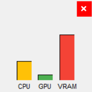

# CoreWatcher

CoreWatcher is a lightweight desktop application that monitors your PC's performance in real-time. It displays a minimal floating gauge with a dynamic color indicator and a small logo, providing instant feedback on CPU usage, temperature, or RAM load.

Ideal for users who want to keep an eye on their system without cluttering their workspace.

## Features

- **Live Monitoring** of:
  - CPU usage
  - GPU usage
  - VRAM usage
- **Color-coded vertical gauges** (green → yellow → red)
- **Minimal borderless UI** that stays on top
- Built with `tkinter`, `psutil`, and `gpustat`
- Small footprint, perfect for side monitoring

## Platform Support

- Windows (.exe build with PyInstaller)
- Linux & macOS support planned

## Preview

<!-- Optional image section -->
<p align="center">
  
</p>

## Getting Started

### 1. Install dependencies

```bash
pip install -r requirements.txt
```

> Required: Python ≥ 3.10

### 2. Run the application

```bash
python main.py
```

## Build as executable (Windows)

Install [PyInstaller](https://pyinstaller.org/) and run:

```bash
pip install pyinstaller # if not already installed
pyinstaller --noconsole --onefile main.py
```

This will create a standalone `.exe` in the `dist/` folder.

## Dependencies

- [psutil](https://pypi.org/project/psutil/)
- [gpustat](https://pypi.org/project/gpustat/)

## Project Structure

```plaintext
CoreWatcher/
├─ src/
│  ├─ core_watcher/
│  │  ├─ app.py              # Main app loop
│  │  ├─ monitor.py          # System performance fetcher
│  │  ├─ ui.py               # Tkinter UI and gauges
│  │  └─ utils.py            # Value → color conversion
│  ├─ dist/
│  │  └─ main.exe            # Compiled executable (Windows)
│  └─ main.py                # Entry point
├─ requirements.txt
└─ README.md
```
